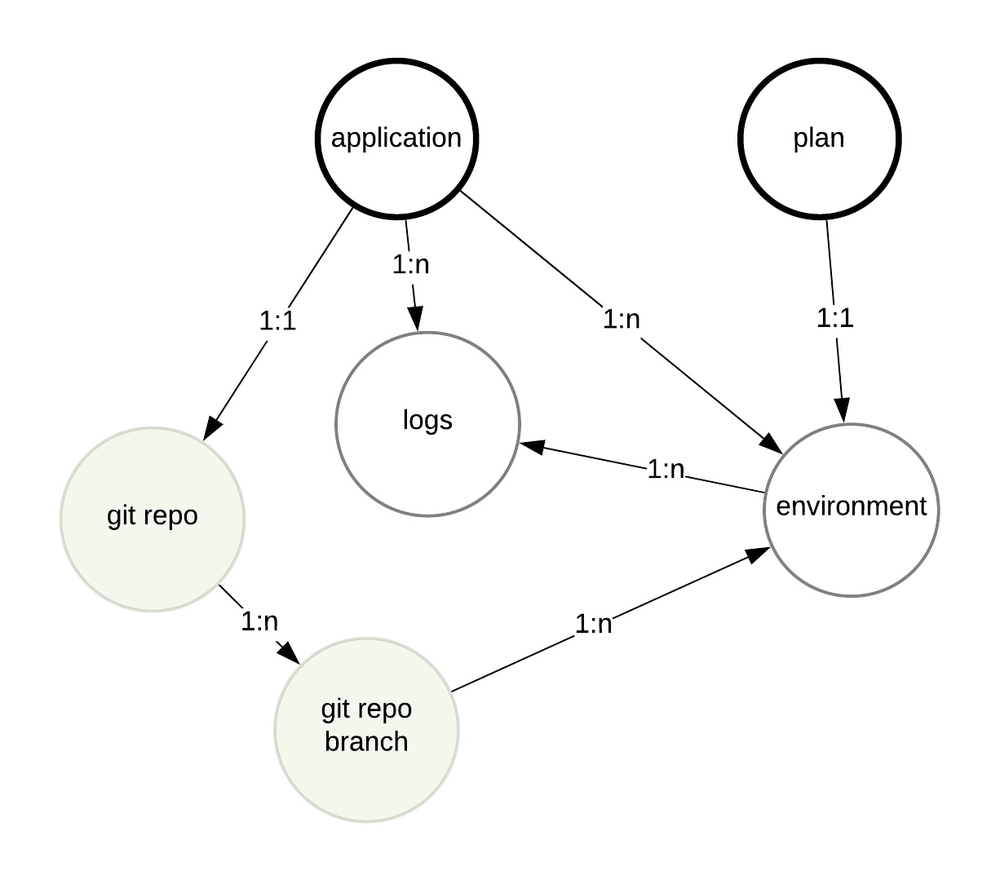
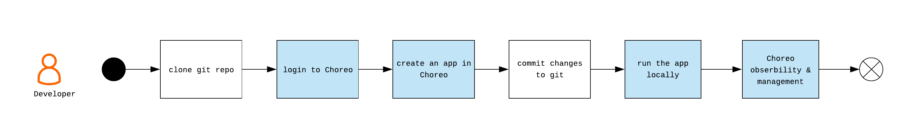
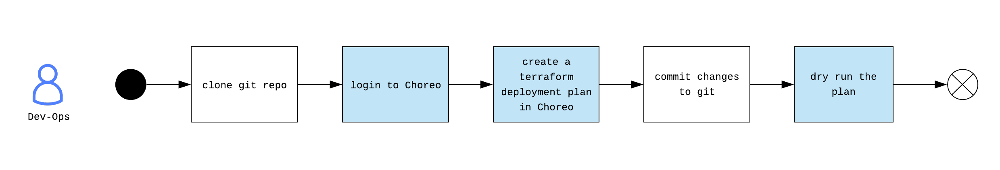
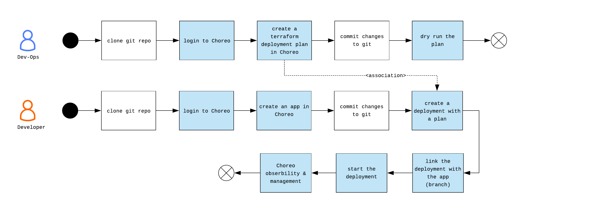

# Choreo Command Line Interface Specification v0.1.0
## Commands and operator style

Choreo CLI design is influenced by *noun-verb* grouping paradigm. It is inspired by [gcloud sdk](https://cloud.google.com/sdk/gcloud/reference/) and it's consistency in handling high-level groupings and associated commands (verbs). During Choreo CLI design, we also referenced fn project's [CLI analysis](https://github.com/fnproject/cli/wiki/CLI-Analysis).

## High level objects (nouns/groups)

`auth` - Choreo auth is the command group that deals with user authentication to Choreo via the CLI. The associated verbs are: `login, revoke, print-access-token, ...`

`application, app` - Choreo app is a placeholder. At minimum this represent some code that can be deployed as one unit (service.bal/service.java/service.js). In a real world situation, an app is a composite. (e.g. App = front end component + backend component + ..) In such a situation, a single app has multiple deployable units. The application is associated with verbs like: `create, describe, ...`

`environment, env` - An environment can be created to deploy an app in Choreo. Environments can be created anywhere, by default it will be in Choreo, but developers can bring their own environments in AWS, GCP etc. (multi-cloud aspect) by selecting a plan. Associated verbs are like: `create, link, start, stop, restart, destroy, ...` 

`plan` - Plan is an environment topology. Dev-Ops engineers can create plans that can build environments. These are terraform templates. There will be a bunch of default plans in Choreo for developers to choose, or they can ask org’s Dev-Ops engineers to create custom plans. Associated verbs are like: `create, describe, dryrun, ...` 

`logging` - Top level object to deal with anytype of a log of an app or part of an app. Associated verbs are like: `tail, trace, ...`

`version` - Choreo backend API version & CLI version

## Object (nouns) relationship



## Developer creating an app and running it locally

 

```
$git clone http://github.com/<user_name>/<app_name>.git
$cd <app_name>
$chor auth login
```

>Login to id.choreo.dev - *this is a one time thing*

>Also think about “$chor login -i” to provide un/pw through cli itself with a multi-factor auth possibly (backlog item)

```
$chor app create <app_name>
```

>Create the app in Choreo

>This always associate the origin repo with all it’s branches

>Init the app with choreo specific environment descriptor (for instrumentation etc.). This descriptor <app_name>.yaml will have app name / description and all other details for git-ops purposes

```
$chor app link <app-name> -url <git repo url>
```

>This will try to link a github repo, but if github is not yet linked to the user account, an error will be fired for asking for github connection `$chor auth connect github`

```
$chor auth connect github
```

>Will connect Choreo user account with user's github account. Similarly `$chor auth connect bitbucket` will connect to bitbucket et. al. Once connected user can link git repos to apps with `$chor app link <app-name> -url <git repo url>`

```
$git add <new files>
```

>$chor create have added new files to the app dir

```
$git commit -m”new files and changes”
$git push origin master
```
>Assuming the dev is working on the master

```
$chor local run <app_name>
```

>This is to run the application locally.

>This will also connect the app with the Choreo cloud using a secure tunnel and will let the app to  be visualized as a sequence diagram

## Dev-Ops engineer creating a topology plan for aws|gcp|azure

 

```
$chor plan create <plan_name> -type aws|gcp|azure
```

>choreo topology plans are created by dev-ops

>Choreo plans are topology plans. These are defined with terraform to setup an environment in IaaSes (aws/gcp/azure/K8s)

```
$chor plan dryrun <plan_name>
```

>Once you create a the devops should be able to do a dryrun of this

## Developer creating an app and deploying it remotely (in Choreo or in aws/gcp/azure..)

 

>… dev-ops flow above 

```
$git clone http://github.com/<user_name>/<app_name>.git`
$cd <app_name>`
$chor auth login`
```

>Login to id.choreo.dev. *this is a one time thing*
>*also think about “$chor login -i” to provide un/pw through cli itself with a multi-factor possibly (backlog item)*

```
$chor app create <app_name> --description <app_description>
```

>Create the app in Choreo

>Init the app with choreo specific environment descriptor (for instrumentation etc.). This descriptor <app_name>.yaml will have app name / description and all other details for git-ops purposes

```
$chor app link <app-name> -url <git repo url>
```

>This will try to link a github repo, but if github is not yet linked to the user account, an error will be fired for asking for github connection `$chor auth connect github`

```
$chor auth connect github
```

>Will connect Choreo user account with user's github account. Similarly `$chor auth connect bitbucket` will connect to bitbucket et. al. Once connected user can link git repos to apps with `$chor app link <app-name> -url <git repo url>`

```
$git add <new files>
```

>$chor create have added new files to the app dir

```
$git commit -m”new files and changes”
$git push origin master
```

>Assuming the dev is working on the master

```
$chor environment create <env_name> -plan <plan_name>
```

>Create an environment remotely in choreo cloud

>When creating an environment devs can link a topology plan (which is pre-configured), based on the plan then the environment will be setup in the chosen IaaS

```
$chor app link <app_name> -env <env_name>
```

>This links an environment to an application. `$chor app link -env <env_name>` will link the environment to the current working app


```
$chor env link <env_name>
```

>This links working source branch of the current app

```
$chor env link <env_name> -b <upstream/featurebranch1>
```

>This links specific source branch of the current app

```
$chor env start|stop|restart -env <env_name>
```

>This starts the app in the environment

```
$chor env destroy -env <env_name>
```

>This removes the environment

```
$chor logging logs trace -env <env_name>
```

>Similarly we need to get tracing through cli


-----------------
## Example application creation and deployment sequence

```
$chor auth login
>>Sucessful!

$chor app create <app_name>
>>Succesful!

$chor app link <app-name> -url <git repo url>
>>Fail connect. Try to connect to github with..
>>$chor auth connect github

$chor auth connect github
>>Sucessful!

$chor app link <app-name> -url <git repo url>
>>Sucessful!

$chor env create <env-name> -plan <plan-name>
>>Sucessful!

$chor app link <app-name> -env <env-name>
>>Sucessful!

$chor env link <env-name> -branch <upstream/featurebranch1>
>>Sucessful!

```